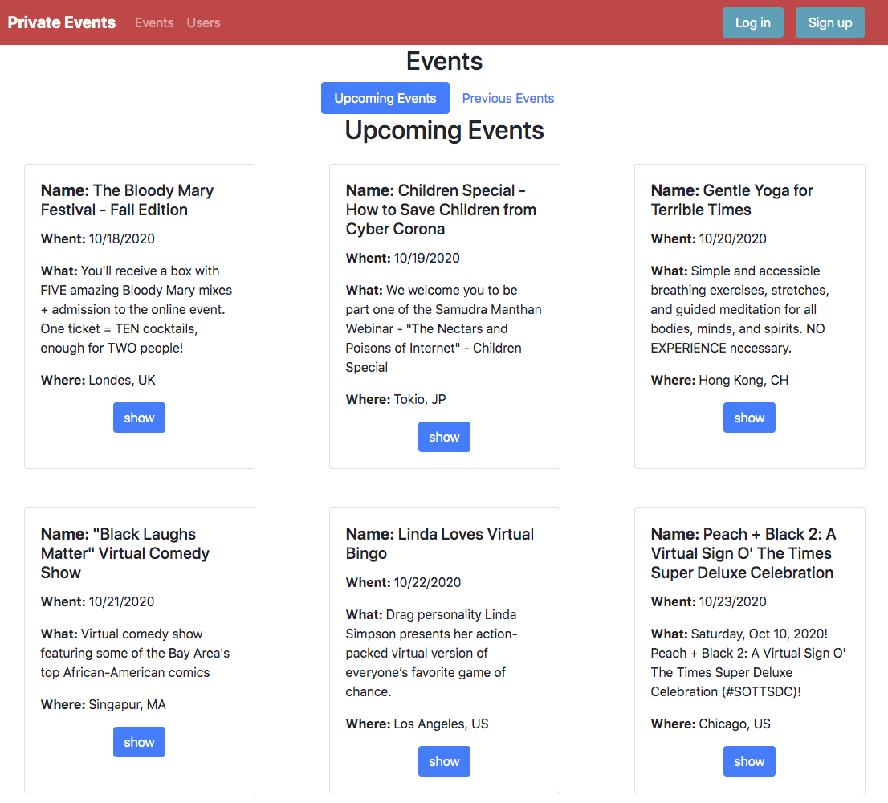
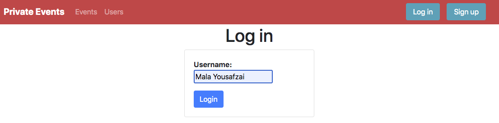
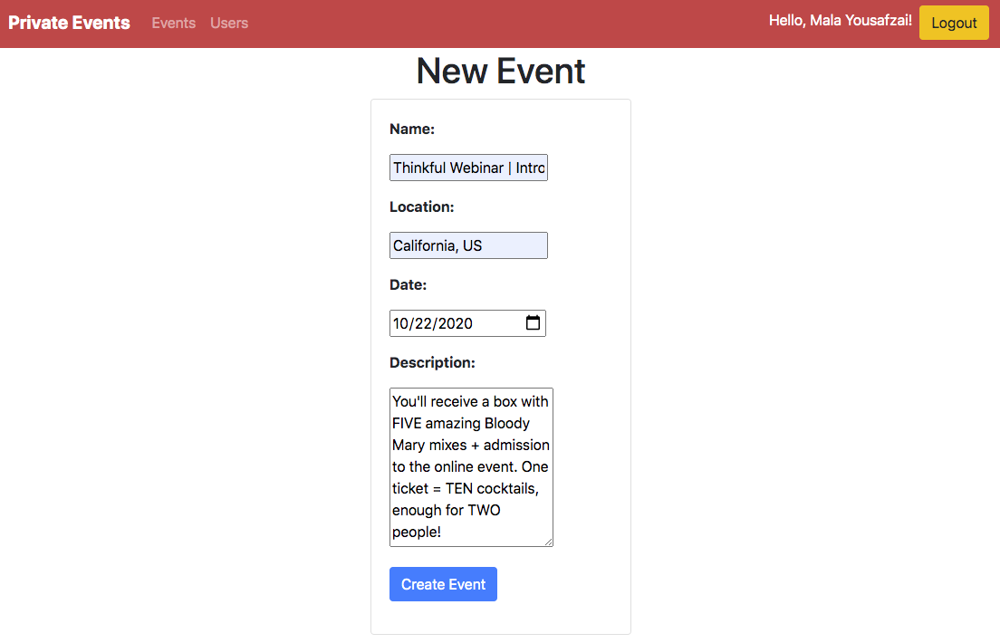
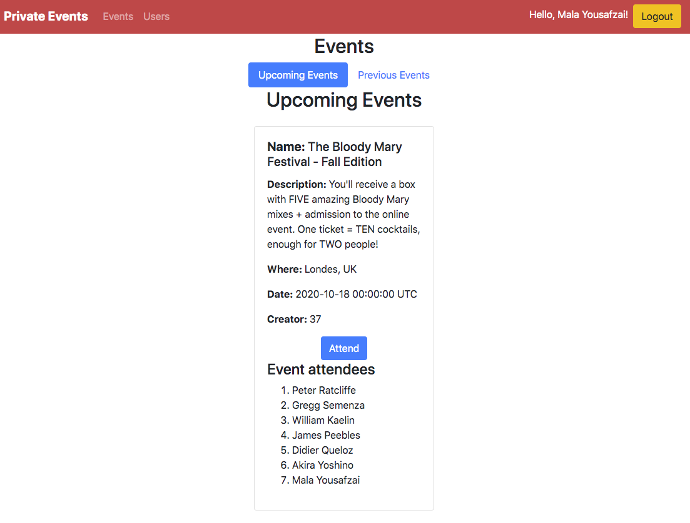

# Private Events (Ruby on Rails Associations) 🚀 

This a site similar to a private   which allows users to create events and then manage user signups. Users can create events and send invitations and parties. Events take place at a specific date and at a location. A user can create events. A user can attend many events. An event can be attended by many users.

## Features

### Log in & Sign up
> If you want to create an event, you have to log in or sign up.

### Create Events
> The event will create with your user( creator of the event).

### Attend Events
> Inside the tab "Events" you can look for the Upcomings Events or the Previous Events. Then you can select the Upcoming Event and attend it.

## Built With

- ruby '2.7.1'
- 'rails', '~> 6.0.3', '>= 6.0.3.2'
- 'sqlite3', '~> 1.4'

## Getting Started

​To have a version on your local machine:

- Clone this repository
- Open a terminal on the containing folder of this project
- Run 'bundle install' to install the dependencies
- Set the database using the command 'bin/rake db:migrate'
- Run the server using the command 'rails server'

- Access http://localhost:3000/ in your browser

- Use the links, forms and buttons to explore the features and create objects in our database

## Authors

👤 **Jasem Duncan Valencia Vargas**

- Github: [@JasemDuncan](https://github.com/JasemDuncan)
- Linkedin: [@Jasem-Duncan-Valencia](https://www.linkedin.com/in/jasem-duncan-valencia/)

👤 **Emanuel González**

- Github: [@KingsleyMcSimon](https://github.com/KingsleyMcSimon)
- Linkedin: [@KingsleyMcSimon](https://www.linkedin.com/in/kingsley-mcsimon-o-44411517a/)

## 🤝 Contributing

Contributions, issues and feature requests are welcome!

Feel free to check the [issues page](issues/).

## Show your support

Give a ⭐️ if you like this project!

## Acknowledgments

- Hat tip to anyone whose code was used
- Inspiration
- etc

## 📝 License

This project is [MIT](lic.url) licensed.
